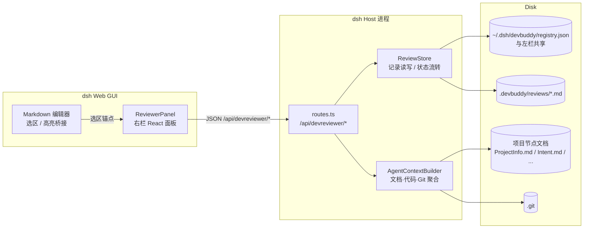
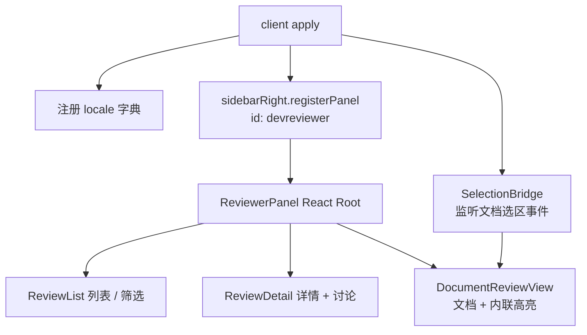
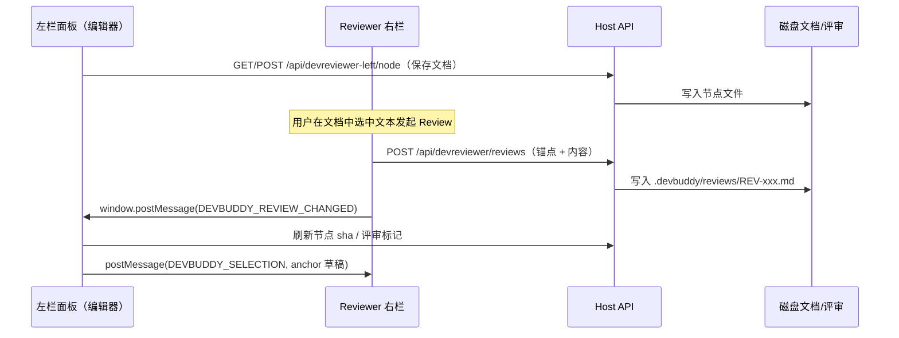

# 总体架构（Architecture）

## 1. 运行时拓扑

Reviewer 插件沿用左栏插件已验证的 **cordis 双面插件（dual-face）** 模式：Node 半与浏览器半分别打包，通过 loopback HTTP 通信。



## 2. 插件基本信息

| 项 | 值 |
| --- | --- |
| 包名 | `dsh-devreviewer` |
| Node 入口 | `exports["."]` → `lib/index.js` |
| 浏览器入口 | `exports["./client"]` → `lib/client.js`（由 `/plugins/dsh-devreviewer/client.js` 提供） |
| cordis 插件名 | `dsh-devreviewer` |
| bundle id | `devreviewer` |
| API 前缀 | `/api/devreviewer`（左栏 `protocol.ts` 已为右栏实现预留此前缀） |
| dsh 引擎 | `>=0.1.5-rc.2` |

`cordis.patch.yml`：

```yaml
- insert:
    - id: devreviewer
      name: 'dsh-devreviewer'
```

## 3. 挂载方式：右栏 panel 席位

与左栏的 DOM-takeover 不同，Reviewer 面板是**评审场景面板**，天然属于右栏内容区。浏览器半通过 `@deepseek-ai/dsh-client-ui-sidebar-right` 暴露的 `ISidebarRight` 注册一个 panel（复用会话右栏的展开/折叠/全屏表现），不改变 `activePanelId`、不挤占中栏。



降级策略：若运行环境的 `sidebarRight` 未提供 panel 注册能力（旧版 shell），退化为与左栏相同的右栏 DOM 容器注入，接口面保持不变。

## 4. 模块划分

### 4.1 Host 半（`src/host/`）

| 模块 | 职责 |
| --- | --- |
| `index.ts` | 插件入口：装配 store、注册路由、懒注入 `workspaceRegistry`（同左栏模式） |
| `routes.ts` | `/api/devreviewer/*` 精确路由；loopback + same-origin 信任围栏（复用左栏 `isTrusted` 模式） |
| `review-store.ts` | Review 记录 CRUD、状态机校验、序号分配、索引维护 |
| `review-files.ts` | Markdown+frontmatter 记录的解析/序列化、项目目录越界防护（复用 `assertInside` 思路） |
| `anchors.ts` | 锚点漂移校正：fuzzy 匹配、quote 定位（见 05） |
| `context-builder.ts` | Agent Context 聚合：目标文档、关联文档、代码、测试、Git 历史（见 07） |
| `agent-dispatch.ts` | 将 Context 包发送至绑定 workspace 的会话 / 创建新会话 |

### 4.2 浏览器半（`src/client/`）

| 模块 | 职责 |
| --- | --- |
| `index.tsx` | client 插件入口：locale、右栏 panel 注册、全局样式 |
| `ReviewerPanel.tsx` | 面板外壳：项目切换、列表 / 详情 / 文档三视图路由 |
| `ReviewList.tsx` | 按状态 / 严重级别 / 文档筛选 |
| `ReviewDetail.tsx` | 详情、讨论、状态操作（Accept / Reject / Send to Agent…） |
| `ReviewComposer.tsx` | Inline Review 提交表单（Severity / comment / proposal） |
| `DocumentReviewView.tsx` | 只读 Markdown 渲染 + Review 高亮标记 + 点击跳转 |
| `selection-bridge.ts` | 选区捕获 → 生成锚点草稿；订阅左栏编辑器的选区广播 |
| `api.ts` | `/api/devreviewer/*` fetch 封装 |
| `protocol.ts` | 线协议类型（与 host 共享，浏览器打包内联） |

## 5. 与左栏插件的协作



协作约定：

1. **不直接互调**：两个浏览器半不共享模块实例，通过 host API 共享磁盘数据；
2. **跨栏事件**用 `window.postMessage`，消息统一前缀 `DEVBUDDY_*`，并校验 `origin`；
3. **项目上下文一致**：右栏读取左栏的共享注册表（`~/.dsh/devbuddy/registry.json`），`activeProjectId` 以左栏最近 `project/open` 为准，右栏可覆盖选择；
4. **乐观锁**：文档保存与评审锚点都带 sha，评审创建时的锚点快照保存当次文档 sha，供漂移校正使用。

## 6. 安全边界

完全复用左栏路由的信任模型：

- 仅注册 **exact 路由**，绕过 `/api` 前缀通道的浏览器鉴权但保留 loopback 围栏；
- 校验 `socket.remoteAddress` 为 loopback、`Host` 为 localhost、拒绝 `Sec-Fetch-Site: cross-site`、校验 `Origin` 同源；
- 所有文件路径相对项目目录解析并做 symlink 感知的 `assertInside` 校验；
- 请求体上限 4 MiB；
- id 走 query/body，不走 path 段（exact 表按路径名索引）。

## 7. 技术选型

| 方面 | 选择 | 理由 |
| --- | --- | --- |
| UI | React 18 + 函数组件 | 与左栏一致，peerDependency 复用宿主 React |
| 构建 | tsdown，双入口 | 与左栏一致 |
| Markdown 渲染 | 复用左栏编辑器同一渲染管线 | 保证选区行号 / heading 标识一致 |
| 评审存储 | 项目内 Markdown + YAML frontmatter | 人可读、可 Git 提交、可离线审阅 |
| 状态管理 | React 本地状态 + API 轮询/事件刷新 | M1 不引入全局状态库 |
