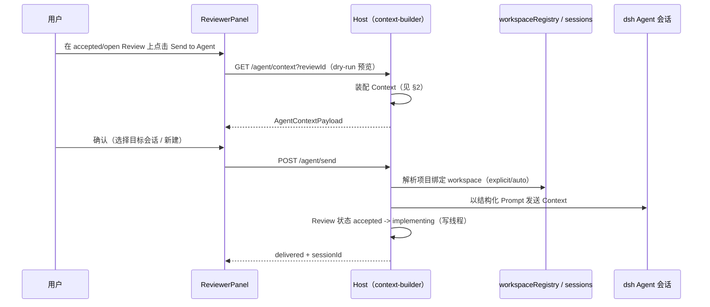

# Review 与 Agent 的连接（Agent Integration）

Review 是 Agent 获取修改任务的重要入口。核心原则：**下发的是经过装配的完整上下文，而不是一句评论。**

## 1. Send to Agent 流程



仅 `accepted`（以及 M2 简化路径下的 `open` 经确认）允许发送；`critical` 在预览页置顶警示但不阻断。

## 2. Agent Context 装配

需求定义的组成：

```text
Review + Target Document + Related Documents + Related Decisions
       + Related Code + Related Tests + Git History  →  Agent Context
```

### 2.1 装配来源

| 组成 | 来源 | 选择策略 |
| --- | --- | --- |
| Review | 记录文件全量（comment/proposal/thread/severity） | 全量 |
| Target Document | `document` 字段指向的节点/项目文档 | **引用**：给 `path` + `sha`，不内联全文（Layer3，Agent 从工作树自读） |
| Related Documents | 同项目其他节点文档、同目录被双向链接的文档 | **引用**：`path` + 一句话 reason 进 `manifest`，不内联全文 |
| Related Decisions | frontmatter `related.decisions` 指向的决策记录 | 显式声明 |
| Related Code | `related.code` 路径；M4 扩展：proposal 中出现的符号名在工作目录内 grep 候选 | 显式优先，符号候选限文件数 |
| Related Tests | `related.tests`；以及 code 邻近的 `*.test.*` / `tests/` 约定文件 | 显式 + 邻近约定 |
| Git History | 对 target document 与 related code 执行 `git log`（最近 N 条，默认 20）与 `git blame` 评审片段所在行 | 仅读，不做任何写操作 |

### 2.2 输出结构

```ts
interface AgentContextPayload {
  reviewId: string
  project: { id: string; name: string; path: string }
  payload: AgentContextLayer2       // 第 2 层结构化 payload，见 §2.3
  type: ReviewType
  severity: Severity
  review: {
    comment: string
    proposal: string
    thread: ThreadEntry[]          // 含 agent/user 区分与 replyTo
    decision: ReviewDecision | null
    anchor: {
      document: string
      selectedText: string
      prefix: string
      suffix: string
      headingPath: string[]
      documentSha: string | null   // 基线版本
      anchorStatus: AnchorStatus   // 当前健康度
    }
  }
  targetDocument: { path: string; sha: string | null; content: string }  // Layer3 起 content 恒为 ''（引用，不内联）
  relatedDocuments: Array<{ path: string; reason: string; content: string }>  // content 恒为 ''，引用进 manifest
  decisions: Array<{ path: string; content: string }>
  code: Array<{ path: string; symbols?: string[]; content: string }>
  tests: Array<{ path: string; content: string }>
  git: {
    log: Array<{ hash: string; author: string; date: string; subject: string }>
    blame: Array<{ line: number; hash: string; author: string }>
    available: boolean          // 非 git 仓库时为 false
  }
  truncated: boolean              // Context 超限时为 true
  instruction: string           // 见 §3 固定模板
}
```

所有文件读取复用项目目录越界防护；`git` 命令以 `cwd=项目根` 执行并设置超时（默认 5s），非 git 仓库或失败时 `available=false`，不阻断发送。

### 2.3 三层投递模型（M4 起）

下发的 Context 按「来源 / 是否随工作树可变」分三层，避免 Agent 重复劳动或读到过期内容：

**第 1 层：Instruction（短，人可读）** —— 由 Layer2 payload 生成的固定英文模板，含任务意图（review 标识、severity、type）、评审正文、建议改法、决策摘要、验收标准指针（Rules + commit trailer）。这是投递给 Agent 会话的**可见文本**（`agent-dispatch.ts` 的 `prompt` content part `text`）。

**第 2 层：结构化 Context Payload（JSON，`AgentContextPayload.payload`）** —— 机器可读的随行契约。当前用于 dry-run 预览与手动复制（AgentPreview「复制 Payload」）。形状：

```yaml
primary:
  review: REV-001
  severity: major
  type: exploration
  decision: "…" | null        # 决策摘要，未决为 null
  threadDigest: |             # 讨论要点（comment/decision 条目，非全文，封顶 12 条）
    - decision:accept …

anchor:
  document: docs/design/x.md
  baseVersion: <documentSha>  # 锚点捕获时的基线版本
  selectedText: |             # 内联：锚点原文（磁盘上可能已变）
    MotionManager 可以…
  prefix: …
  suffix: …
  resolution:                 # AnchorResolver 预计算，Agent 不必重算
    status: valid|moved|modified|outdated|orphaned
    confidence: 1
    currentOffset: [1420, 1583] | null   # 当前 LF 半开偏移；fuzzy/orphaned 为 null

manifest:                     # 引用：repo 内对象，给 path + 一句话 reason，不给全文
  - { path: docs/specs/a.md, reason: "linked from review or document" }

workspace:
  repo: <project 名>
  commit: <HEAD sha> | null   # 锁定工作树版本
```

**第 3 层：内容本体投递分流** ——

| 内容 | 投递方式 | 原因 |
| --- | --- | --- |
| Review + Thread + Decision | 内联 | DB 独有，是任务意图本体 |
| Anchor `selectedText`/`prefix`/`suffix` | 内联 | 原文版本内容，磁盘可能已变 |
| Anchor `resolution` 结果 | 内联 | 系统已算过，避免 Agent 重复模糊匹配 |
| 目标文档当前版 | 引用（`path` + `sha`，`targetDocument.content` 为空） | Agent 从工作树读最新版 |
| 相关文档 | 引用（`path` + `reason`，进 `manifest`，无 content） | repo 内，Agent 自取；reason 说明为何值得读 |
| 决策 / 代码 / 测试 | 内联进 instruction extras | Agent 真正需要其文本内容 |
| Git history | 摘要（log 前 20 + 锚点行 blame）进 instruction | Agent 可自行 `git log`，仅给关键上下文 |

> 现状边界（M4）：可见投递文本为 Layer1 instruction；实际持久化进 Agent 会话的只有该文本。Layer2 payload 目前仅生成并用于 dry-run 预览/手动复制——平台 `sessionController.prompt` 的 text part 只有 `{type,text}`，`admitPromptContent` 会重建 text part 剥离任何额外字段，`UserMessage` 亦无 metadata 槽位，故 Layer2 暂不能随会话消息持久化；待平台开放消息 metadata / Agent Run 模型后再接入（同时补 `run:`/`task:` 标识）。
>
> 投递契约：`sessionController.prompt(request, signal)` 的第二个参数 `signal: AbortSignal` 为**必传**（服务实现首行即 `signal.throwIfAborted()`）；dispatcher 用一个不取消的 `new AbortController().signal` 传入。失败以 throw RemoteError 表达（无 `accepted:false`），由 dispatcher 收敛为 `fallback:"controller-error"`。


## 3. Prompt 组装

`instruction` 使用固定模板（英文骨架 + 中文内容原样保留），明确任务性质与验收口径：

````text
You are acting on a reviewed engineering document in the DevBuddy workflow.
Review id: {review_id} (severity: {severity})

# Requirement under review
Target document: {target_document} — read the current version from the worktree yourself
(path@sha in the structured payload; it is referenced, not inlined).

# Review comment
{comment}

# Proposed change
{proposal}

# Discussion so far
{thread}

# Related decisions / code / tests / git history
{decisions}
{code}
{tests}
{git_log}

Rules:
1. Treat the review as the task; the quoted text is the location in the document.
2. Do not change requirements beyond the review scope; note diverging concerns as new review candidates instead.
3. After implementation, summarize changed files and how they map to the review.
4. Suggest commit trailer: DevBuddy-Review: {review_id}
````

## 4. 下发通道（M4 方案）

复用左栏已验证的 workspace 链接解析（explicit / auto / null）：

| 情况 | 行为 |
| --- | --- |
| 绑定 workspace 且存在活动会话 | 调用 dsh sessions 服务向该会话发送消息（复用左栏注入的 `sessions` 服务形态，host 侧经对应会话 API） |
| 绑定 workspace 无活动会话 | 在该 workspace 新建会话并发送 |
| 无 workspace 链接 | 弹层要求先在左栏绑定，或仅复制 Context 到剪贴板（降级路径） |

host 的 `agent-dispatch.ts` 对 dsh 会话 API 做薄适配；若目标版本无可用 API，降级为「打开会话 + 预填消息」，由用户手动发送，Context 结构不变。

## 5. 状态回连

- 发送成功：迁移 `accepted -> implementing`，`assignee` 记为目标会话/Agent 标识，线程追加 `kind=status` 条目并记录 `sessionId`，同时在 `related.agent_runs` 回填；
- M4 轮询/事件获知会话任务完成后：不自动 verified，而是在 Review 详情显示「Agent 报告完成」，由人执行 `implementing -> implemented -> verifying -> resolved`；
- 验收打回（`verifying -> implementing`）时可再次 Send to Agent，Context 中自动追加打回原因与最新 Git 变更；
- Agent 完成后在 `related.commits` 回填关联提交（M4 依据 commit trailer 解析，仅提示，不强制）。

## 6. 安全与边界

- 只执行只读 Git 命令（`log`/`show`/`blame`/`status`/`diff`），禁止任何写/网络类命令；
- Context 体积上限（默认 256 KiB），超出按 code/tests 截断并在 payload 中标注 `truncated: true`；
- dry-run 与实际发送使用同一装配函数，保证「所见即所发」；
- 不把 registry 等项目外文件纳入 Context。

## 7. M4 验收标准

1. 对一条 accepted Review 点 Send to Agent，dry-run 预览包含 7 类组成，缺项有明确原因；
2. 确认后目标会话收到完整 Context（非单句评论），Review 自动进入 implementing；
3. 非 git 项目下 git 部分 `available=false`，发送不失败；
4. 大仓库下 Context 不超上限并正确标注截断；
5. Agent 完成后仅提示人工验收，不自动关闭 Review。
