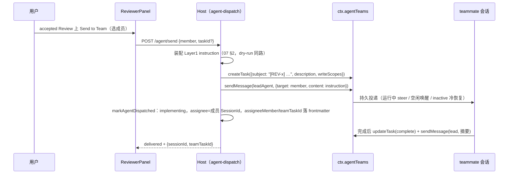

# Review 派发与 Agent Teams 集成（Agent Team Integration）

本文是 [07-agent-integration.md](07-agent-integration.md) 的扩展篇：把 Send to Agent 的目标从「裸 dsh session」升级为 **Agent Teams 的具名小队成员（teammate）**，并引入共享任务板做全程跟踪。调研基线：`@deepseek-ai/dsh-experimental-agent-team@0.1.6-alpha.2`（源码逐项核实，2026-09-17）。

> **实施状态（2026-09-18）**：P1（成员指派 + 邮箱派发，§3.2）、P2（任务板模式 createTask + 完成协议 + `team_task_id` 落账，§3.3）、P3（状态回环 `remoteView` 轮询 → `agentCompletion` 建议，§3.5）均已实现并通过测试（68 项）。未做：P2.1 blockedBy 依赖编排、多 Lead 队伍管理的 UI 面。

## 1. 背景与目标

07 §4 的下发通道只有 session 一种目标（显式 sessionId / 工作区最近会话 / 新建会话）。Agent Teams（平台 experimental 插件，本机 web profile 已启用）在此之上提供：

- **具名持久 teammate**：可跨轮续用、可冷恢复（inactive → 唤醒），有明确分工（如 `doc-scout`、`writer`）；
- **持久邮箱**：消息落盘、不丢不重，运行中 steer / 空闲唤醒 / 离线排队；
- **共享任务板**：任务 DAG（`blockedBy`）、claim/complete/release/reassign、CAS 版本防覆盖。

目标：Review accept 后可**指派给 team member**，`assignee` 记录成员身份，执行过程在任务板上可跟踪，完成后回连 Review 状态。

## 2. 平台能力核实（v0.1.6-alpha.2）

### 2.1 身份模型（与现有机制天然兼容）

- **teammate 本质是一个可持续对话的 subagent child session**：`TeamMemberView.id` 就是 `SessionId`。现有 `assignee = sessionId`、`related.agentRuns` 的语义无需变更即可承接；
- 团队挂在 **Lead session log** 上（TeamService "backed by the exact live Lead Session log"），Lead 即用户当前会话；会话树里 teammate 的 `subagent.address.parentSessionId` 指回 Lead；
- `TeamMemberView`：`{ id: SessionId, name, role: 'lead'|'teammate', status: 'running'|'idle'|'inactive'|'provisioning'|'failed', description?, provider?, context?: 'fresh'|'fork', model? }`。

### 2.2 Host 侧全量 API（`ctx.agentTeams: TeamService`）

注入模式与 `sessionController` 完全相同（最小 wire shape + cordis token，见 `src/index.ts` L46 的既有先例）。核心方法（首参均为 `caller: Agent` 活体成员凭证）：

| 方法 | 用途 |
| --- | --- |
| `listMembers(caller)` | roster 视图（§2.1 形状） |
| `sendMessage(caller, {target, content, signal})` | 持久邮箱投递 + 即时送达尝试 |
| `createTask(caller, {subject, description, blockedBy?, writeScopes?})` | 上共享任务板，返回 revision-1 任务 |
| `updateTask(caller, {taskId, expectedRevision, action, owner?…})` | claim / complete / release / reopen / **reassign**（Lead 专属）/ edit / delete / set_dependencies，CAS |
| `getTask(caller, id)` / `listTasks(caller)` | 读板（含就绪诊断 `ready`） |
| `spawnTeammate(caller, {name, description, prompt, context, provider, signal})` | 建队（仅 Lead） |
| `interrupt(caller, targetName)` / `waitForChange(caller, timeoutMs, signal)` | 打断（保留收件箱）/ 等待变化 |
| `tryMembership(agent)` / `membership(agent)` | 身份解析（非成员返回 undefined） |

### 2.3 客户端 Remote API（生成 contribution `remote.agentTeams`）

仅暴露三个方法：`view` / `createTask` / `updateTask`。凭证传 **Lead 的 sessionId**，由 Remote 层解析为活体 Agent——`client-ui-agent-team` 的现成模式（`src/client/mount.ts`）：

```ts
const leadSessionId = (sessionId: SessionId): SessionId => {
  const address = sessions.binding(sessionId)?.session.getSnapshot().subagent?.address
  return address?.parentSessionId ?? sessionId   // teammate 会话映射回 team root
}
await ctx.remote.agentTeams.view(leadSessionId(currentSessionId))
```

**`sendMessage` / `spawnTeammate` 不在 Remote API 上**——插件要走消息派发必须在 host 侧集成。

### 2.4 凭证获取（host 侧集成的关键）

host 侧从 `ctx.agents`（AgentRegistry）按 session id 取活体 Agent（agent id == session id）：

```ts
const leadAgent = ctx.agents.get(brandString<SessionId>(leadSessionId))  // undefined = 无活体 Lead
```

## 3. 集成设计

### 3.1 分阶段

| 阶段 | 内容 | 改动面 |
| --- | --- | --- |
| P0 | 口头派发：用户对 Lead 说「把 REV-x 派给某成员」，Lead 用自带 team 工具执行 | 零改动（现状即可用，但 review 文件不落 assignee） |
| P1 | 成员选择器 + `sendMessage` 派发分支 | ReviewComposer + agent-dispatch + review-store |
| P2 | 任务板模式（**推荐形态**）：Send to Team = createTask + sendMessage | P1 基础上增加任务跟踪与状态回连 |
| P3 | 状态回连自动化（waitForChange 订阅） | host 常驻订阅 |

### 3.2 P1：成员指派（sendMessage 派发分支）

1. **UI**：`ReviewComposer` 在关联方（`RelatedParty`，静态 `employee_a|agent_a` 标签，不参与派发）旁新增「负责成员」下拉：客户端注入 `remote.agentTeams`，`view(leadSessionId)` 拉 roster 填充（展示 `name (status)`）；无团队 / 未装 agent-team 插件时优雅降级（隐藏并沿用现状路径）；
2. **Host 派发分支**：`AgentDispatcher` 增加目标类型。目标为成员时走 `ctx.agentTeams.sendMessage(leadAgent, { target: 成员名, content: Layer1 instruction, signal })`。**禁止**直接 `sessionController.prompt(teammateSessionId)`——那会绕过持久邮箱 / 冷恢复语义；
3. **落账**：`markAgentDispatched` 扩展——`assignee` 仍记成员的 SessionId（兼容现有格式与 session-feed 关联），frontmatter 新增 `assigneeMember`（成员名）与 `teamTaskId`（P2 起）。

最小 wire shape（沿用 `SessionControllerLike` 的声明式惯例）：

```ts
export interface AgentRegistryLike {
  get(id: string): unknown | undefined   // 活体 Agent，无则 undefined
}
export interface TeamServiceLike {
  listMembers(caller: unknown): Array<{ id: string; name: string; role: 'lead' | 'teammate'; status: string }>
  sendMessage(caller: unknown, request: {
    target: string
    content: Array<{ type: 'text'; text: string }>
    signal: AbortSignal
  }): Promise<{ messageId: string }>
  createTask(caller: unknown, request: {
    subject: string; description: string
    blockedBy?: readonly string[]; writeScopes?: readonly string[]
  }): Promise<{ id: string; revision: number }>
  updateTask(caller: unknown, request: {
    taskId: string; expectedRevision: number
    action: 'claim' | 'complete' | 'reassign' | 'release' | 'reopen' | 'edit' | 'delete' | 'set_dependencies'
    owner?: string
  }): Promise<{ id: string; revision: number }>
}
```

### 3.3 P2：任务板模式（推荐形态）

评审 accept 后点 **Send to Team**：

1. `createTask`：`subject = "[REV-0005] {title}"`，`description` = 07 §2 的 Layer1 instruction 全文（复用 context-builder，含 review id 与验收规则），`writeScopes` 从 review 目标推导（如锚点文档路径）或留空；
2. `sendMessage` 通知目标成员认领（**任务创建本身不会通知任何人**，必须补一条消息，或让成员在指令中被点名负责）；
3. 依赖表达：评审 A 的产出是评审 B 的输入时，`blockedBy` 串成 DAG；
4. 可视化复用现成的 `client-ui-agent-team` 面板（roster + 任务板 + teammate 会话导航），无需自研。

指令模板（07 §3）追加 team 侧完成协议：

```text
Team protocol:
5. When done, mark team task {team_task_id} completed (updateTask, action=complete)
   and send_message a summary to "lead" quoting review id {review_id}.
```

### 3.4 P2 时序



### 3.5 状态回连（P2 起人工、P3 自动）

- 沿用 07 §5 原则：**不自动 verified**。teammate 完成（updateTask complete + 消息摘要）后，Review 详情显示「Agent 报告完成」，由人执行 `implementing → verifying → resolved`；
- P3：host 侧 `waitForChange(leadAgent, …)` 常驻订阅任务板，把 `completed` 事件映射为 Review 状态推进提示（仍止步于提示，人工验收）。

## 4. 风险与边界

- **experimental 无稳定性承诺**：0.1.x-alpha，API 可能破坏性变更。本机 web profile 已 pin `0.1.6-alpha.2`；wire shape 全部走最小声明，升级时只改适配层；
- **凭证是硬约束**：`sendMessage` 不在 Remote API 上，客户端不能直接发消息；host 侧需要 `ctx.agents.get(leadSessionId)` 拿活体 Agent，Lead 会话不在时该路径整体不可用（降级为现有 session 派发）；
- **团队生命周期绑定 Lead session**：Lead 会话关闭后团队状态仍在 log 中，但凭证路径失效；不要把团队当作跨会话的持久队列使用；
- **部署上限**：16 成员 / 256 任务 / 每成员 64 条排队消息 / 单消息 64 KiB——Layer1 instruction 需维持 07 §6 的 256 KiB 以内更严格约束；
- **共享工作目录**：全队同一 cwd，`writeScopes` 仅告警不阻断（advisory），与现有「只执行只读 Git」边界并行不冲突；
- **消息投递语义**：mailbox 消息 accepted 即持久，不因目标暂不可达而失败——派发结果里的 `delivered` 与 session 路径含义不同，UI 文案需区分（「已入队」vs「已送达」）。

## 5. 验收标准

**P1**

1. 有团队时 ReviewComposer 出现成员下拉（含状态展示），无团队时隐藏且原路径不受影响；
2. 选中成员派发：目标 teammate 收到完整 Layer1 instruction（非单句评论），Review 进入 implementing，`assignee` 为成员 SessionId、`assigneeMember` 为成员名；
3. inactive 成员派发成功冷恢复；Lead 无活体 Agent 时降级为现有 session 派发并提示。

**P2**

4. Send to Team 后任务板出现 `[REV-x]` 任务，目标成员认领 → 完成全程在板可见；
5. 成员完成后 Lead 收到带 review id 的摘要消息，Review 详情出现「Agent 报告完成」提示，且不自动 verified；
6. `blockedBy` 串联的两条评审，后继任务在前置完成前不可认领（`ready=false`）。

## 6. 参考

- 平台源码：`packages/experimental/agent-team/src/{index,types,roster,mailbox,task-board}.ts`、`packages/experimental/client-ui-agent-team/src/client/mount.ts`（deepseek-harness checkout）；
- 本插件：[07-agent-integration.md](07-agent-integration.md)（Context 装配 / 三层投递 / 状态回连）、`src/host/agent-dispatch.ts`（sessionController 适配先例）、`src/host/review-store.ts` `markAgentDispatched`（落账点）、`src/protocol.ts` `RelatedParty`（关联方现状）；
- 实测样板：本仓库 2026-09-17 的团队演练（doc-scout / writer：建任务 → 认领 → 持久消息 → 完成 → CAS 版本流转）。
