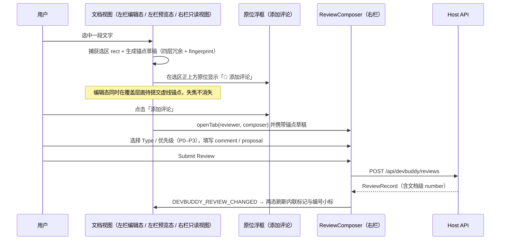

# Inline Review：交互与锚点

Inline Review 是系统最核心的功能：用户直接选中文档中的一段文字即可发起评审，评审长期与原文位置保持关联。锚点与解析语义对齐 [DES-003](../../../../Downloads/robot_studio_new/DES-003-Document%20Anchor%20&%20Review%20Thread%20Model.md)。

## 1. 交互流程

核心交互：**在哪个视图选中，就在选区正上方原位弹出「添加评论」浮框**，不再经跨栏提示条中转。左栏编辑态、左栏预览态、右栏只读视图三入口行为一致。



浮框形态（轻量，仅一个动作 + 关闭，不内联表单）：

```text
            ┌──────────────────────┐
            │ 💬 添加评论      ✕   │
            └──────────────────────┘
   ┌──────── 选中文字（原位高亮）────────┐
```

完整表单仍在右栏 Composer：

```text
┌──────────────────────────────┐
│ 💬 Add Review                │
├──────────────────────────────┤
│ Type: Suggestion             │
│ 优先级: P1（Major）           │
│                              │
│ MotionManager 不应该直接     │
│ 参与控制权仲裁。             │
│                              │
│ 建议增加 GlobalAuthority     │
│ Manager。                    │
│                              │
│ [Submit Review]              │
└──────────────────────────────┘
```

**标题默认值（请求 17）**：Composer 打开时标题输入框不再为空——将选区文本 `selectedText` 的连续空白（含换行）折叠为单个空格并 `trim`，按显示宽度取前 **15 个字**预填为标题，超出时追加 `...`。字宽按视觉宽度计：**英文字母每个 0.5 个字，其余字符（中文、数字、标点、空格等）每个 1 个字**；按 Unicode 码点（`Array.from`）逐字累加，下一字会使总宽超过 15 时停止（如「DevBuddy 是一个用于项目开发自」恰好 15：8 字母=4 + 空格 1 + 10 中文=10；纯英文 22 字母仅 11 宽可完整保留）。标题仅为预填默认值，用户可继续编辑或清空后提交（校验仍只要求评论文本非空）。选区回显（`.dbr-quote`）保留原始文本与换行，不做折叠。

**零长度「插入点」评论（请求 18）**：除「选中文字 → 原位浮框」外，评审面板提供**不依赖选区**的入口：统计行（`N 未关闭 · 已关联工作区`）下方的「快捷操作」模块中的「添加评论」按键。点击后右栏向左栏请求**当前编辑态 textarea 的纯光标位置**（详见 §2.4），构造 `selectedText === ''`、`offsetStart === offsetEnd` 的 **point anchor** 直接进入 Composer。point anchor 没有选区文本，因此：标题输入框保持为空（提交时标题缺省，存储为 `title: null`，列表/详情显示「未命名评审」）；选区回显位改为提示行「插入点评论（无选中文字，锚定在光标位置）」（`.dbr-quote-point`，i18n key `composer.pointAnchor`）；跳过非空选区校验，仅要求评论文本非空。

## 2. 入口与跨栏协议

| 入口 | 行为 |
| --- | --- |
| 左栏**编辑态** textarea 选区 | 选区稳定后在选区 rect **正上方**原位弹「添加评论」浮框；同时在覆盖层绘制待提交虚线锚点（失焦不消失）。点击浮框直接 `openTab('devbuddy-reviewer', { params })`，params 扩展携带 `draftAnchor`，右栏直接进入 Composer。不再广播 `DEVBUDDY_SELECTION` 让右栏显示提示条 |
| 左栏**预览态** MarkdownText 选区 | 同一浮框（位置/样式/行为一致）；锚点草稿由渲染 DOM 选区反推源码得到（见 §2.2） |
| 右栏 DocumentReviewView 选区 | 右栏只读文档自带的浮层按钮改到选区**正上方**，同样只含「添加评论」，点击就地展开 Composer |
| 右栏**快捷操作 → 添加评论**（请求 18，无选区） | 统计行下方「快捷操作」模块的按键；不依赖选区，右栏经 §2.4 CARET 握手向左栏取回聚焦编辑器的纯光标位置，构造 0 长度 point anchor 进入 Composer；无聚焦编辑器时显示 hint |

前三个选区入口产出的锚点结构完全一致；第四个入口产出 point anchor（`selectedText:''`、两偏移相等）。锚点草稿随 openTab 一次性带入 Composer，不单独走跨栏消息；`DEVBUDDY_SELECTION` 消息协议废弃（协议定义可保留一版以兼容未刷新的旧左栏，右栏收到时不再弹提示条，仅忽略）。

### 2.1 openTab 参数扩展

```ts
// 左栏 -> 右栏（openTab params，替换旧的 SelectionMessage 主路径）
interface ReviewerTabParams {
  projectId: string
  document: string
  reviewId?: string              // 已有：深链详情/文档视图
  draftAnchor?: {                // 新增：从选区直接进入 Composer
    selectedText: string
    prefix?: string
    suffix?: string
    lineStart: number
    lineEnd: number
    headingPath?: string[]
    section?: string | null
  }
}
// 右栏 -> 左栏（评审创建/删除后）保持不变
interface ReviewChangedMessage {
  source: 'devbuddy-reviewer'
  type: 'DEVBUDDY_REVIEW_CHANGED'
  projectId: string
  document: string
  reviewIds: string[]
}
```

接收方必须校验 `event.origin === window.location.origin` 且 `source` 字段正确。

**深链落点**：gutter 小标、预览 mark 角标、评审列表卡片三处点击均经 `openTab` 深链；仅带 `reviewId`（不带 `document`）时右栏落入**评审详情**（ReviewDetail），不再跳到文档 md 视图。带 `document` 才进入文档行内视图。

### 2.2 文档树快照与请求-应答握手

右栏列表需要按左栏节点顺序分组、并以节点折叠态作为各组初始开合状态，因此左栏通过同窗口 postMessage 广播**有序文档树 + 折叠态**：

```ts
// 左栏 -> 右栏：全量快照（挂载、切项目、折叠变化时广播 + 400ms 补发一次）
interface DocTreeMessage {
  source: 'devbuddy-left'
  type: 'DEVBUDDY_DOC_TREE'
  projectId: string
  nodes: Array<{ document: string; title: string; collapsed: boolean }>
}
// 右栏 -> 左栏：晚开时按需拉取（挂载 / activeProjectId 变化即发，500ms 再补一次）
interface DocTreeRequestMessage {
  source: 'devbuddy-reviewer'
  type: 'DEVBUDDY_DOC_TREE_REQUEST'
  projectId: string
}
```

左栏的 `onDocTreeRequest` 监听器仅在请求的 `projectId` 与其当前 active 项目一致时回发一份 `DocTreeMessage`。右栏始终收不到快照时按文档首次出现顺序分组兜底（组头即文件名，不折叠），保证单栏独立可用。

### 2.3 预览态选区反推源码锚点

预览态用户选中的是 GFM 渲染后的文本（语法符被剥离、实体被解码、软换行折叠），不能直接当源码选区。策略：

1. 客户端基于文档 LF 原文构造**纯文本投影**：剥离 markdown 语法符（`#`/`*`/`` ` ``/链接括号/图片标记等）、解码常见实体、折叠空白，同时保留「投影偏移 → 源码偏移」的映射表；
2. 取 `window.getSelection()` 的渲染文本与选区前缀/后缀，归一化后在纯文本投影中搜索命中（先精确、再用 prefix/suffix 消歧、最后模糊），经映射表换算回源码 `selStart/selEnd`；
3. 复用编辑态同一份 `buildAnchorDraft(content, start, end)` 生成 `selectedText + prefix + suffix + headingPath + lineStart/lineEnd`。host 解析本身以文本冗余为主、行号仅为估计，因此反推有 1~2 字符误差不影响锚定；
4. 反推失败（选区落在代码块/shiki、KaTeX、footnotes 等排除子树，或置信度过低）时不弹浮框，或浮框以禁用态提示「该区域暂不支持评论」。

### 2.4 光标请求-应答（point anchor 入口）

「快捷操作 → 添加评论」不依赖页面选区，右栏经 postMessage 主动向左栏拉取**当前聚焦的编辑态 textarea 光标**：

```ts
// 右栏 -> 左栏：请求当前编辑光标（点击即发，0ms + 300ms 双发兜底晚加载）
interface CaretRequestMessage {
  source: 'devbuddy-reviewer'
  type: 'DEVBUDDY_CARET_REQUEST'
  projectId: string
}
// 左栏 -> 右栏：聚焦编辑器应答一个零长度锚点草稿
interface CaretMessage {
  source: 'devbuddy-left'
  type: 'DEVBUDDY_CARET'
  projectId: string
  document: string
  anchor: ReviewAnchorDraft   // selectedText:'' 且 offsetStart === offsetEnd
}
```

- 左栏仅 `mode === 'edit'` 的 NodeCard 注册 caret provider；provider 仅在 `document.activeElement` 正是自身 textarea 时，以 `buildAnchorDraft(content, caret, caret)` 应答（`selectedText` 为同偏移切片，自然为空串；`lineStart === lineEnd`；携带 `offsetStart/offsetEnd`）。
- DevBuddyPanel 全局只挂一个 `onCaretRequest` 监听：项目不匹配直接忽略；按注册顺序遍历 provider，取第一个非 null 快照应答（同项目理论上只有一个聚焦编辑器）。
- 右栏用 **nonce** 管理每次点击的应答归属：收到 `DEVBUDDY_CARET` 即 bump nonce、清 hint、进入 composer。点击后 **800ms** 内无应答（无编辑态焦点 / 左栏未加载 / 项目不符），在按键下方显示 hint「请先在左栏文档的编辑状态中定位光标。」（`actions.addCommentHint`）；**5s** 后 hint 自动消失。期间再次点击会以新 nonce 重新计时。

## 3. 锚点模型

行号不稳定（文档随时在编辑），锚点采用**语义化冗余定位**，按可靠性分四层（与数据模型 §4 一致）：

1. **Version**：`documentSha`，判断基线是否已变更；
2. **Structural**：`headingPath` / `section`，缩小搜索范围；
3. **Textual**：`selectedText` + `prefix` + `suffix`，fuzzy 定位与消歧主依据；
4. **Positional**：`lineStart` / `lineEnd`（1-based，初始估计与滚动提示）+ `offsetStart` / `offsetEnd`（**LF 归一化、0-based、左闭右开**的字符偏移；新客户端创建的锚点均携带，host 校验与文档原文严格一致）。

另存 **Fingerprint**：`sha256(prefix + selectedText + suffix)`，用于 O(1) 判断「原始上下文是否仍完整存在」。锚点在创建瞬间快照，之后不可变。

**point anchor（0 长度插入点）**：`selectedText === ''` 且 `offsetStart === offsetEnd`（同一光标位置，允许位于文档末 `content.length` 处）；`lineStart === lineEnd`，`prefix`/`suffix` 同样为空、fingerprint 为 sha256('')。host `createReview` 对 point 分支单独校验（整数、两偏移相等、界内），不再要求 `selectedText` 非空；解析（§4）无文本可匹配，仅以持久化的光标偏移为信号——落在原行即 `valid`，文档缩短时偏移 clamp 到文末、行号变化即 `moved`（confidence 0.7，作为 NEEDS_REVIEW 候选），不产生 modified/outdated/orphaned（文档整体缺失仍 orphaned）。判定助手为协议层 `isPointAnchor(anchor)`。

## 4. Anchor Resolution（漂移校正）

host 的 `anchors.ts` 在读取评审（`GET /review`、`GET /document`）时实时解析。**Anchor Status 与 Review Status 分离**：解析结果只描述锚点健康，不直接改写评审状态（见 06）。

### 4.1 Resolver 优先级

```text
1. fingerprint 全等          → valid（原始上下文完整存在）
        ↓ 不等
2. exact(selectedText) 唯一命中 → valid
        ↓ 多命中
3. exact + prefix + suffix 消歧 → valid / moved
        ↓ 失败
4. headingPath 小节内 exact    → moved
        ↓ 失败
5. 全文归一化 fuzzy 匹配       → modified（相似度 0.80~0.95）
                                 outdated（0.50~0.80，实质变化）
        ↓ < 0.50
6. 全部失败                    → orphaned
```

| state | 含义 | confidence | UI 表现 |
| --- | --- | --- | --- |
| `valid` | 原文可准确定位（位置可不变或精确移动） | ≥ 0.95 | 实线高亮 |
| `moved` | 原文仍在，但跨段落/小节移动 | ≥ 0.95 | 实线高亮 + 新行号 |
| `modified` | 原文被轻微改写，高度相似内容仍存在 | 0.80~0.95 | 虚线高亮（黄色），需人工确认 |
| `outdated` | 原文已发生实质变化 | 0.50~0.80 | 详情页「目标已实质变化」+ 快照对比 |
| `orphaned` | 无法找到对应内容 | < 0.50 | 「目标文本已不存在」，quote 快照仍可读 |

### 4.2 匹配算法（M2）

- 归一化：CRLF→LF、trim 行首尾、折叠连续空白；
- fuzzy 用 Levenshtein 相似度（中文按字符），阈值表见上；**阈值为初始经验值，随真实数据校准，不作为固定产品规则**；
- 多候选时用 `prefix`/`suffix` 与 headingPath 打分排序；
- 纯前端可做同样计算用于即时滚动定位，但**以 host 返回的 `anchorResolution` 为权威结果**。

### 4.3 对 Review Status 的联动

解析结果按以下规则影响评审（由 host 在读取时计算，**不写回 status**，而是作为建议展示）：

- `valid` / `moved`：评审状态不变；
- `modified` / `outdated` / `orphaned`：UI 将该 Review 标记为「NEEDS_REVIEW 候选」，由人确认后显式迁移到 `needs_review`（见 06）。文档变化**不自动删除或关闭** Review。

## 5. 文档内标记与编号小标

每条评审在所属文档内有一个单调编号 `N`（见 03 数据模型；UI 各处只显示数字，不带 `#` 前缀）。标记在编辑态与预览态都必须可见，点击任何标记/小标都深链到该评审**详情**（`openTab` 只带 `reviewId`，不带 `document`；见 §2.1）。

**统一视觉语言（请求 18）**：选区高亮 = **severity 淡底 + 首尾各一道 2px 竖线「`|`」分隔符**，**不再改变被选文字的字符颜色**（mark 一律 `color: inherit`，竖线颜色由 severity 档实色变量提供：右栏 `--dbr-pipe`、左栏 `--dbl-rv-pipe`）。三端的「`|`」实现不同但视觉一致；0 长度 point 没有区间，退化为**单根 2px 竖条**（不带底色块）。

### 5.1 预览态：内联 mark + 右上角编号角标

预览态渲染的是 GFM（MarkdownText 原语），其 props 无 children/ref 注入点，因此标记采用**渲染后 DOM 幂等注入**：

1. 左栏用自有 `<div ref>` 包裹 `MarkdownText`；右栏 DocumentReviewView 直接渲染行容器；
2. 在 `useLayoutEffect`（内容/投影 settled、非 streaming 中）依据 host 返回的锚点投影（`selectedText` + `matchOffsetStart/End` + `anchorStatus`）用 TreeWalker 遍历 TEXT_NODE、以 Range 分段（`extractContents` 避免 `surroundContents` 跨元素抛错）插入：
   ```html
   <mark class="dbr-anchor dbr-edge-start dbr-edge-end" data-review-id="REV-0001" data-anchor-status="valid"
         data-severity="major">…原文…
     <button class="dbr-anchor-num" data-review-id="REV-0001">3</button>
   </mark>
   ```
   - 首尾「`|`」由 mark 上的 `dbl-rv-edge-start` / `dbl-rv-edge-end` 类以 `box-shadow: inset ±2px 0 0 0 var(--dbl-rv-pipe)` 绘制（只画在软换行后片段的真实首/末视觉行，不随每行重复）；mark 本身 `color: inherit`，字符颜色不变；
   - **point anchor** 不包文本：在光标处 `splitText` 后插入一个空 inline `<span class="dbl-rv-point dbl-rv-point-sev-{sev}" data-dbl-rv="point">`（2px × 行高的 severity 实色竖条），编号 chip 挂在竖条上（`data-review-id` 照常深链）；point interval 放行、不参与相邻区间合并，unwind 时随注入节点一并清理；
3. 角标绝对定位在 mark 右上角，仅显示文档内编号 `N`（不再带 `#` 前缀），描边/文字按优先级分档配色；点击角标深链打开评审**详情**（阻止冒泡，不触发文本选择）；
4. 注入必须**幂等可重放**：React 每次重渲染后先清理本插件注入的节点（按 `data-review-id` 识别并解包），再重新注入；
5. 排除子树：`.md-code-block`（shiki `dangerouslySetInnerHTML`）、`.katex`、`section.footnotes`；这些区域的评审退化为行级底色提示 + gutter/角标列表；
6. 同一文本片段被多条评审命中：合并为一个 mark，角标并列显示多个 `#N`（`flex` gap 排列），点击各自独立深链；区间重叠但不完全重合时按最小区间优先，其余评审以同元素多 `data-review-id`（空格分隔）+ 多角标呈现；
7. 颜色按 severity 分档，描边按 anchorStatus 区分：valid/moved 实线，modified 虚线（黄），outdated/orphaned 点线灰；orphaned 在正文无落点时不插 mark，仅在 gutter 与列表中可见。

### 5.2 编辑态：覆盖层内联高亮 + gutter 编号小标并列

textarea 文本层无法插入 DOM，编辑态标记为**三层堆叠**（均绝对/相对定位在 `.dbl-editor` 内）：

- **层 0 · 背景覆盖层（`.dbl-editor-overlay`，z-index 0，`pointer-events: none` + `aria-hidden`）**：为每条已生效评审画空 `<span>` 几何块（点击不拦截，编辑态打开评审走 gutter 小标）。按 `matchOffsetStart/End` 精确绘制；偏移不可得（outdated/orphaned）时退化为 `lineStart~lineEnd` 行级底色块。每个区间产出：① 一个背景 rect（`.dbl-rv-hl`，severity 14% 底色，`lineLevel` 时加 `.dbl-rv-line-level`）；② 首端 2px 竖条 `.dbl-rv-bar.dbl-rv-bar-start` 与末端 `.dbl-rv-bar-end`（`margin-left: -1px` 贴在背景块真实边界，背景取 `--dbl-rv-pipe` 实色，视觉即首尾「`|`」）；软换行跨多片时竖条只挂首/末片。**point anchor** 只产出一个 `.dbl-rv-bar.dbl-rv-bar-point`（2px × 行高竖条，无底色块；`range.start === range.end` 时走 `pointRects()`）。坐标由 `rangeRects()/pointRects()` 相对 `.dbl-editor` 根盒输出（已含 mirror 的 gutter 位移 + 12px padding）。
- **层 1 · textarea（`.dbl-editor-ta`，z-index 1）**：正常文字颜色（`color: inherit`），承担可见字形、caret、IME 组词与系统原生选区。高亮区间**不再重绘/改变任何字符颜色**（旧的 mirror 着色层已废弃）；选区阶段不叠加任何插件标记，插件标记只在评论生效后显示。
- **层 2 · ink 镜像层（`.dbl-editor-mirror`，z-index 2）**：与 textarea 严格同度量（同 font 13px / line-height 1.7 / padding / `white-space: pre-wrap` / 换行宽度），仅供 `Range` 几何测量（TreeWalker 把列偏移解析为 `{node, offset}`，空行用零宽空格撑满行高）；文字 `color: transparent`，不含任何着色 span。
- **gutter 编号小标**：废弃「单行聚合计数」。每条评审在其 `lineStart` 行渲染一个独立编号小标，按钮内仅显示编号 `N`（无 `#` 前缀），`data-review-id` 携带自身 id；同一行多条评审时小标**横向并列**（flex + gap，容器随数量自适应加宽，不换行挤压行号）。点击任一小标深链到对应评审详情；`drifted`（moved/modified/outdated/orphaned）双类特异性把优先级色覆盖为中性灰空心胶囊，title 提示漂移状态（例如 moved 锚点的 7 号评论显示灰框，正文/预览 mark 仍保留优先级色）。
- **gutter 布局常量（行号靠左）**：行 `.dbl-editor-ln` 绝对定位 `left: 4px; right: 4px`，flex `justify-content: flex-start; gap: 3px`——渲染顺序为**行号在前、badge 组紧随其后**，行号统一贴 gutter **左缘** 4px，badge 与行号间距固定 3px（无 badge 的行只显示行号；最宽行内容恰好填满列宽，不出现 badge 与行号之间的空档）。小标 `.dbl-rv-badge` 为描边胶囊 `min-width: 16px; height: 15px; padding: 0 2px; border-radius: 4px`，单位数字宽恰好 16px 不截断。gutter 总宽由组件按最宽行动态计算：`4 + (行号位数*8+2) + (有pill?3:0) + maxPillsWidth + 4`，单 pill 宽 `max(16, ⌈位数*6.4⌉+6)`、并列 pill 间距 2px。行号按文档最大行数的位数**前补零**（`padStart(lineDigits,'0')`，如 234 行文档第 3 行显示 `003`），让 tabular-nums 预留的字形格全部填满（请求 16）；右栏只读视图 gutter 同步补零。

### 5.3 右栏只读视图

与 5.1 同一套 mark/角标语义（渲染路径不同：右栏 `DocumentReviewView` 按原始 md 行渲染，可直接在行内包 `<mark>`，无需渲染后注入）；gutter 同样为一评一编号小标并列、行号前补零。浮层按钮（FAB）移到选区**正上方**。

- **字符级切分**：进入视图时按 LF 建全局偏移表（每行 `[start, end)`），再以各锚点的 `matchOffsetStart/End` 对每行做 `LineSeg` 切分（before / review 区间 / after），因此同一行内的多个重叠区间可精确包成各自的 mark，而不是整行着色；
- **区间 mark**：`<mark class="dbr-anchor dbr-edge-start …" data-review-ids="REV-0002">`，mark 一律 `color: inherit`（**字符颜色不变**），底色为 severity 14% 淡底；首尾「`|`」由 `.dbr-edge-start { box-shadow: inset 2px 0 0 0 var(--dbr-pipe) }` / `.dbr-edge-end { box-shadow: inset -2px 0 0 0 var(--dbr-pipe) }` 绘制，竖线颜色随 severity 四档（`--dbr-pipe` 在 mark 上按档覆写），软换行时只在真实首/末视觉行出现；
- **point mark**：0 长度锚点不包任何字符，在切点渲染 `<span class="dbr-doc-point dbr-point-sev-{sev}" data-review-ids="REV-0003">`——`display:inline-block; width:2px; height:1em; margin:0 -1px 0 0` 的 severity 实色单竖条；moved/modified/terminal 修饰类与区间 mark 同规则；
- **chips 共存**：编号 chip（`.dbr-anchor-num` 等内联小标）挂在区间 mark 内部末缘 / point 竖条右缘；同一字符区间（或同一 point 切点）命中多条评审时，`data-review-ids` 空格分隔、chips 横向并列，点击任一 chip 或 mark 本体均 `openGroup` 深链到对应评审详情（chip 各自带自己的 reviewId，阻止冒泡）。

### 5.4 列表与详情

评审列表以左栏文档树（§2.2 `DocTreeMessage`）为准组织：

1. **按文档聚合**：同一文档的评审归入一个 `.dbr-doc-group`，组头始终渲染（即使该组折叠）——**文件名 basename**（如「ProjectInfo.md」「CoreRequirements.md」，不是左栏流程节点名）+ 计数；组头前有随折叠态旋转的 chevron 视觉指示。不同文档的组之间渲染一条分隔线（`.dbr-doc-group + .dbr-doc-group`）。
2. **顺序**：组的顺序 = 左栏节点顺序；组内卡片按文档位置（`lineStart` 升序）排列，与正文出现顺序一致。
3. **整条组头点击开合**：与左栏 DevBuddy 节点行一致，组头 `.dbr-doc-group-head` 整体为 `role="button"`/`tabIndex=0` 的可点击行（Enter/Space 键盘同效，`:hover` 浅底、`:focus-visible` 描边），点击 chevron、文件名或计数任意位置均切换折叠；chevron 退化为纯视觉 `<span aria-hidden>`，文件名不再承担独立导航（请求 16；进入文档视图仍可经详情页的 `.dbr-detail-doc` 链接）。
4. **折叠与手动开合**：初始折叠态取左栏节点 `collapsed`，折叠时只隐藏卡片、组头与计数保留。组头可在评审面板内手动展开/折叠（本地覆盖，按文档路径记录）；左栏节点折叠态再次发生跳变时清除该文档的本地覆盖，两栏重新同步。不再渲染「已折叠文档中有 N 条评审被隐藏」提示。
5. **快照外文档兜底**：未出现在快照中的文档（右栏单开、快照缺失）按首次出现顺序各自成组，组头即文件名，默认展开。
6. 卡片只有两行：标题行（文档内编号 `N`（无 `#` 前缀）+ 标题）与 pill 行（优先级 P0–P3、状态、类型、时间）；原第二行 `§ section · Ln` 定位栏已删除（文件归属由组头表达）。详情页、线程、状态迁移均带 `N`，`REV-XXXX` 完整 id 保留在详情/调试处。
7. 面板顶部标题为「**当前项目**」（tab chrome 上的插件名「评审」不变，避免重复）。

**优先级表述（P0–P3）**：UI 一律称「优先级」，底层 `Severity` 枚举与存储不变，展示映射：

| UI | 底层 severity | 含义 |
| --- | --- | --- |
| P0 | `critical` | 最高优，必须立即处理 |
| P1 | `major` | 高 |
| P2 | `minor` | 中（新建评审默认） |
| P3 | `info` | 低/提示 |

Composer 下拉按 P0 → P3 顺序排列；列表、详情、gutter/预览标记的配色仍取自底层 severity 四档。

## 6. 边界与约束

- 选区必须落在单一文档内；跨 heading 的选区允许，`section` 取选区起点所在标题；
- 普通选区路径：空选区、只选空白、超过 4000 字符的选区不可提交（浮框不出现或置灰）。**显式例外：point anchor**（请求 18）——右栏「快捷操作 → 添加评论」不依赖选区，经 §2.4 CARET 握手取回左栏聚焦编辑器的纯光标位置，以 `offsetStart === offsetEnd`、`selectedText: ''` 直接进 Composer；host 校验 caret 为整数且 `0 <= caret <= content.length`（允许文档末），不做 trim 非空与切片一致性校验；
- 代码块内选区允许，锚点行号基于文档原文而非渲染结果；但预览态 shiki 代码块、KaTeX、footnotes 子树不做渲染后注入与选区反推，编辑态 textarea 中仍可正常选中；
- 浮框定位：以选区首行 rect 为基准，水平居中于选区、垂直位于选区**正上方** 4~8px；上方空间不足（容器顶/滚动边界）时翻转到选区下方；选区变化、滚动、Esc、点击空白或成功提交后关闭；
- 浮框内只放「添加评论」一个主动作（+ 关闭 ✕），不内联表单，避免遮挡正文；
- 文档被重命名 / 移动：M2 通过左栏节点注册（`legacyFiles` 机制）识别；M2 之外的普通文档重命名在列表中显示为「文档缺失」，提供重新绑定入口（M5）。

## 7. M2 验收标准

**锚点解析（既有）**

1. 在被评审段落**之前插入若干行**，刷新后 `anchorStatus = moved` 且高亮落在新位置；
2. 修改被评审段落中的少量文字，`anchorStatus = modified` 且人工可确认；
3. 大幅改写或删除被评审段落，分别为 `outdated` / `orphaned`，quote 快照仍可读，并出现「NEEDS_REVIEW 候选」提示；
4. 同一段文字重复两次、prefix/suffix 不同时，锚点能正确区分并定位。

**本轮迭代（编号 / 标记 / 原位浮框）**

5. **预览态选区**：左栏预览（MarkdownText）选中一段正文后，选区正上方立即出现「添加评论」浮框；点击后右栏进入 Composer 且锚点文本正确；提交后预览正文被选片段出现内联高亮；
6. **编辑态待提交锚点**：编辑态选中文字后，除系统选区高亮外，覆盖层出现虚线待提交锚点；鼠标点击别处、焦点离开 textarea，该锚点与浮框仍在（Esc / 关闭 / 提交后才消失）；
7. **两态可见已提交标记**：同一条评审在预览态可见内联高亮 + 右上角编号角标 `N`，编辑态可见覆盖层高亮；切换编辑/预览不丢失；
8. **文档级编号与并列小标**：每条评审获得文档内单调编号；编辑态 gutter 行号统一贴左缘 4px，小标只显示数字 `N`（无 `#` 前缀，单位数胶囊宽 16px），紧挨行号右侧 3px；同一行存在多条评审时多个小标横向并列，评论最多的行 badge 与行号之间无空档；各自点击深链到对应评审详情；删除评审后编号不复用、允许空号；锚点漂移（如 moved）的小标置灰，正文 mark 仍保留优先级色；
9. **预览角标**：预览态角标附着在被选文字标记的右上角，多评审同片段时角标并列，点击各自打开对应评审详情（非文档 md 视图）；
10. **原位浮框一致性**：编辑态、预览态、右栏只读视图三处浮框均位于选区**正上方**（空间不足自动翻转下方），样式与「添加评论」文案一致；右栏不再出现旧的跨栏选择提示条。

**列表聚合 / 优先级 / 文档树联动（请求 14）**

11. **三入口深链详情**：gutter 小标、预览角标、列表卡片三处点击均直接进入 ReviewDetail，不落入文档 md 图示；
12. **优先级 P0–P3**：Composer 与列表/详情统一称「优先级」，下拉顺序 P0/P1/P2/P3、默认 P2，与 critical/major/minor/info 一一对应；
13. **当前项目标题**：评审面板顶部显示「当前项目」，与 tab chrome 的「评审」不重复；
14. **按文档聚合**：列表按左栏节点顺序分组，组头「文件名 + 计数」（ProjectInfo.md / CoreRequirements.md 等 basename，非流程节点名）且始终渲染，组间有分隔线，卡片不重复文件名；组内严格按文档行序排列；
15. **折叠保留组头 + 手动开合**：左栏节点折叠时只隐藏该组卡片，组头（文件名 + 计数 + chevron）保留；**整条组头**（非仅 chevron）可点击/键盘开合，行为与左栏节点行一致；左栏折叠态再次跳变时清除本地覆盖并实时同步；不再有「已折叠文档中有 N 条评审被隐藏」提示；
16. **晚开握手**：评审 tab 在左栏 400ms 补发窗口之后才打开时，经 `DEVBUDDY_DOC_TREE_REQUEST` 拉取快照，直接呈现正确分组，不落入首次出现顺序兜底；
17. **卡片定位栏移除**：卡片仅标题行 + pill 行两行，不再显示 `§ section · Ln` 行号/章节栏（请求 15）；
18. **行号前补零 + 整行开合（请求 16）**：编辑态与右栏只读视图行号按最大位数 `padStart` 补零（234 行文档呈 `001…234`，单位数文档不补）；评审列表组头整条（chevron/文件名/计数任意位置）点击或 Enter/Space 均可开合，文件名不再单独导航到文档视图。
19. **新建评审默认标题（请求 17）**：Composer 打开时标题输入框预填报区文本（连续空白折叠为空格并 `trim` 后）按显示宽度计的前 15 个字——英文字母每个 0.5 个字、其余字符每个 1 个字，超出追加 `...`；用户可编辑或清空后提交，选区回显仍保留原始换行。

**快捷操作 / point anchor / 统一高亮（请求 18）**

20. **快捷操作模块**：评审面板统计行（如「2 未关闭 · 已关联工作区」）正下方渲染「快捷操作」模块，首项为「添加评论」按键；
21. **CARET 取回光标**：左栏某文档处于编辑态且其 textarea 聚焦时，点击「添加评论」，右栏经 `DEVBUDDY_CARET_REQUEST`（0ms + 300ms 双发）/ `DEVBUDDY_CARET` 应答取回当前项目、文档与纯光标偏移，以 0 长度 point draft 进入 Composer，回显「插入点评论（无选中文字，锚定在光标位置）」而非选区 quote；
22. **point 提交落盘 title:null**：point Composer 标题输入框默认为空；不填标题直接提交后评审落盘 `title: null`，列表与详情显示「未命名评审」；host 对 `selectedText:''` + 两偏移相等 + caret 在 `[0, content.length]` 的 draft 放行，指纹取空串；
23. **无焦点 hint 时序**：左栏无任何聚焦的编辑态 textarea 时点击「添加评论」，不进入 Composer；约 800ms 后按键下方显示「请先在左栏文档的编辑状态中定位光标。」，约 5s 后自动清除；期间在左栏定位光标需再次点击才会发起请求；
24. **三端统一高亮（背景 + `|`，无字符变色）**：同一条区间评审在左栏编辑态（overlay rect + 首尾 2px 竖条）、左栏预览态（mark + inset box-shadow 竖线）、右栏文档视图（mark + `.dbr-edge-start/end`）三端均只呈现 severity 淡底与首尾「`|`」，被选文字字符颜色与正文一致（`color: inherit`）；
25. **point 单点竖条**：0 长度评审在三端均退化为单根 2px 竖条（编辑态 `.dbl-rv-bar-point`、预览态 `.dbl-rv-point`、右栏 `.dbr-doc-point`），无底色块、不包字符，颜色取 severity 实色；
26. **point 标记三端可点**：编辑态 gutter 编号小标、预览态竖条上的编号 chip、右栏文档视图 point 竖条，点击均深链打开该评审详情（右栏落 detail 路由，非 document 视图）；
27. **point 漂移解析**：point 锚点所在行之前插入/删除行后刷新，caret 偏移被 clamp 到文档长度内：仍在原行显示 valid，行号变化显示 moved（confidence 0.7，标记需人工复核候选），不产生 modified/outdated。
