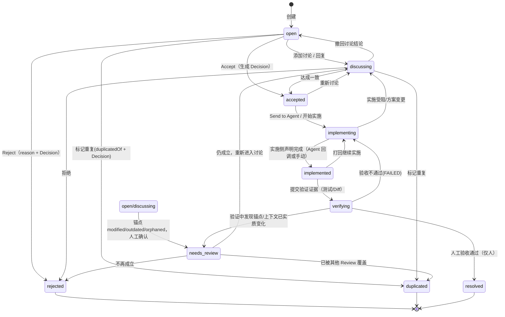

# Review 生命周期（Lifecycle）

## 1. 状态机

对齐 [DES-003](../../../../Downloads/robot_studio_new/DES-003-Document%20Anchor%20&%20Review%20Thread%20Model.md) 的完整链路，并把「锚点失效需人复核」固化为 `needs_review` 一等状态：

```text
OPEN → DISCUSSING → ACCEPTED → IMPLEMENTING → IMPLEMENTED → VERIFYING → RESOLVED
```

旁路：`OPEN → REJECTED`、`OPEN → DUPLICATED`，以及锚点失效触发的 `NEEDS_REVIEW`。完整状态机：



终态：`resolved` / `rejected` / `duplicated`。

## 2. 迁移规则

| from | to | 必要条件 |
| --- | --- | --- |
| open | discussing | 至少一条讨论条目（创建时填写 comment 不触发，需追加回复） |
| open/discussing | accepted | 生成 `decision: accept`（见 03 §6） |
| open/discussing | rejected | `reason` 非空 + `decision: reject` |
| open/discussing | duplicated | `duplicatedOf` 指向存在 Review + `decision: duplicate` |
| open/discussing | needs_review | 锚点解析为 modified/outdated/orphaned 且人确认 |
| needs_review | discussing | 人确认仍成立 |
| needs_review | rejected/duplicated | 人确认不再成立 |
| accepted | implementing | 经过 Send to Agent，或手动标记开始 |
| implementing | implemented | 实施侧声明完成（M4 Agent 任务完成回调或手动） |
| implemented | verifying | 附带验证证据（测试路径 / Diff 摘要） |
| verifying | resolved | 人工确认验收（终态判定权始终在人，Agent 不可） |
| verifying | implementing | 验收打回（FAILED），线程记录原因 |
| verifying | needs_review | 验证中发现锚点已实质失效 |
| 任意非终态 | discussing | 出现新的实质讨论时允许回退（open↔discussing 例外） |

约束：

- 非法迁移返回 409，`error` 形如 `illegal transition: verifying -> open`；
- 每次迁移在正文 `## Thread` 追加一条 `kind: status` 条目（含 `fromStatus/toStatus/时间/操作人/reason`）；
- 终态记录不可追加普通评论（如要复活，M5 提供「Reopen」，先不做）；
- `duplicated` 写入 `duplicated_of`，并在被指向 Review 的 related 中体现反向链接（列表层计算，不双向写文件）。

## 3. Anchor Status 与 Review Status 分离

这是两条独立维度（对齐 DES-003 原则 2）：

- **Review Status**：评审的工作流结论（open/accepted/resolved…），只经状态机迁移；
- **Anchor Status**：锚点在当前文档中的健康度（valid/moved/modified/outdated/orphaned），由 Resolver 实时计算，**不落盘**。

交互规则：文档变化导致锚点为 modified/outdated/orphaned 时，UI 提示「NEEDS_REVIEW 候选」，由人显式把 Review 迁入 `needs_review`——**文档变化不自动改变 Review Status**。

## 4. Severity 与 Type

### 4.1 Severity

| severity | 含义 | 列表配色 | 对 Agent 的含义（M4） |
| --- | --- | --- | --- |
| info | 说明 / 疑问，不要求改动 | 灰 | 仅作为背景信息 |
| minor | 建议优化 | 蓝 | 可排入任务 |
| major | 设计/实现存在明显问题，应修改 | 橙 | 默认随 Accept 下发 |
| critical | 方向性 / 安全 / 正确性问题，阻塞继续实施 | 红 | 建议优先下发；**critical 的 Resolve 仅人可执行** |

### 4.2 Type（新增）

用于筛选与 Agent 任务分类，与 severity 正交：

| type | 含义 |
| --- | --- |
| question | 疑问，求澄清 |
| exploration | 探索（新提案 / 待验证的方向，不预设为缺陷） |
| suggestion | 改进建议（默认） |
| bug | 文档/实现中的错误 |
| design_issue | 设计问题 |
| requirement_issue | 需求问题 |
| implementation_issue | 实现问题 |
| test_issue | 测试问题 |

## 5. 操作权限（M1~M4 单机模型）

M1 不引入账号体系，`author` 为本地固定标识（`reviewer`），状态操作不做权限拦截，仅保证审计轨迹完整。预留 M5 多身份扩展，并遵循「Agent 可执行 Review，但不可决定 Review」：

| 操作 | reviewer（人） | agent |
| --- | --- | --- |
| 创建 / 讨论 / 接受 / 拒绝 / 重复 | ✅ | M5 可对其被指派的 Review 追加讨论（`author.type=agent`） |
| 产生 Decision（accept/reject/…） | ✅ | ❌（M5 在 UI 与 host 双重拦截） |
| implementing → implemented | 手动 ✅ | Agent 完成后**建议**迁移（写线程），由人确认 |
| verifying → resolved | ✅ 仅人（critical 强制） | ❌ |

## 6. 并发控制

- 状态迁移与线程追加都走 host 端读—校验—追加—原子写；
- 请求带 `expectedSha` 时做乐观锁校验，冲突返回 409，客户端刷新后重试；
- 迁移校验以 host 读到的当前状态为准，客户端按钮仅做展示层收敛（非法动作置灰），不作为安全边界。

## 7. 通知与列表

- 左栏节点 / 项目 tab 展示未关闭计数（open + discussing + needs_review + accepted + implementing + implemented + verifying）；
- 右栏列表默认筛选「未关闭」，提供视图：Open / In progress（accepted+implementing）/ Verify（implemented+verifying）/ Closed；
- 支持按 `type` 与 `severity` 组合筛选；
- critical 且未关闭的 Review 在项目头部常驻警示条；
- 跨栏变化通过 `DEVBUDDY_REVIEW_CHANGED` postMessage 与 `visibilitychange` 刷新，无长连接。

## 8. 与 Git 记录的关系（可追溯性）

Review 文件本身随项目 Git 提交，提供评审的「为什么」；状态迁移只改变工作流状态，不自动产生提交。M4 起 Agent 完成实施时在任务中引用 `review_id`，并在 `related.commits` / `related.agent_runs` 回填关联，形成可追溯链：

```text
Review → Decision → Agent Run → Change/Commit → Test → Verify → Resolve
```

建议约定 commit trailer：`DevBuddy-Review: REV-0001`（仅约定格式，M4 不强制写入）。
