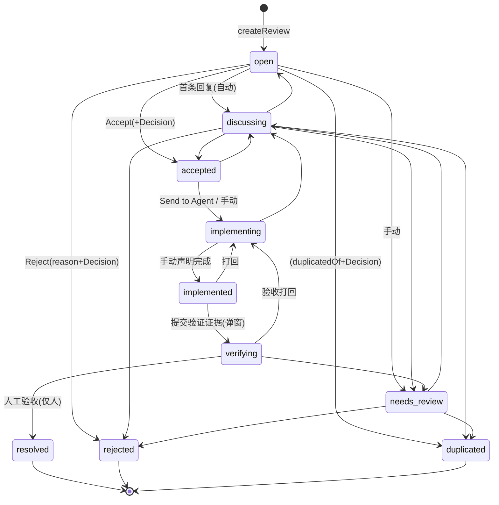

# Reviewer 状态机现状整理 + 优化分析

> 目的：在重构前，把「评审插件」当前的状态机**如实盘点**（跨 host / client / 存储三层），标出实现与设计（`06-lifecycle.md`）的偏差，并结合 `reviewer_设计参考/lifecycle-refactor.md` 给出优化清单。
> 结论先行：状态机本身不是 bug，是**成本高 + 噪音多 + 三层各写一份**。核心问题可归为 4 类痛点 + 5 处工程一致性缺陷。

---

## 1. 状态机现状（按代码实测，非设计文档）

### 1.1 状态全集（10 个）

来源 `src/protocol.ts` L45-68：

| 状态 | 归类 | 谁在等 | 备注 |
| --- | --- | --- | --- |
| `open` | 非终态 | 人 | 创建默认态 |
| `discussing` | 非终态 | 人 | **首条回复自动进入**（review-store L438） |
| `needs_review` | 非终态 | 人 | 锚点失效旁路，**当前靠人手动进/出** |
| `accepted` | 非终态 | 人/Agent | 有 Decision |
| `implementing` | 非终态 | Agent | 实施中 |
| `implemented` | 非终态 | 人 | 「实施声明完成」 |
| `verifying` | 非终态 | 人 | 「已提交验证证据，待验收」 |
| `resolved` | 终态 | — | 无出边 |
| `rejected` | 终态 | — | 无出边 |
| `duplicated` | 终态 | — | 无出边 |

### 1.2 迁移表（host 权威，`src/host/lifecycle.ts` L18-30）

```text
open         → discussing, needs_review, accepted, rejected, duplicated
discussing   → open, needs_review, accepted, rejected, duplicated
needs_review → discussing, rejected, duplicated
accepted     → implementing, discussing
implementing → implemented, discussing
implemented  → verifying, implementing
verifying    → resolved, implementing, needs_review
resolved / rejected / duplicated → （终态，无出边）
```

状态图：



### 1.3 特殊写入路径（不是普通 transition）

1. **`markAgentDispatched`（review-store L626-689）** — Send to Agent 一步连跳：
   - `open` → 补写 `accepted` + accept Decision → 再写 `implementing`；
   - `accepted` → 直接 `implementing`。
   - 结果：`accepted` 在 Agent 路径上是**人看不见的瞬时中间态**，一次点击落 2~3 条 thread 记录。

2. **首条回复自动 `open → discussing`（review-store L438-448）** — `appendReview` 里硬编码，非 UI 触发。

3. **Agent 回连（session-feed + review-store L794-819）** — `turn/end` 且 `completed` 时，只把 Agent 最终回复**追加为 comment**，**不推进任何状态**（`implementing` 停在原地，等人手动点）。这是设计 06 §5 承诺但未落地的部分。

### 1.4 三层「开放/终态」定义分散

| 判定 | 定义位置 | 实现方式 |
| --- | --- | --- |
| 终态 | `lifecycle.ts` isTerminal | 硬编码 3 个 |
| 开放态 | `protocol.ts` OPEN_STATUSES | 硬编码 7 个数组 |
| 开放态 | `lifecycle.ts` isOpen | `!isTerminal` |
| 列表分组 | `client/ReviewList.tsx` VIEW_STATUS | 又一份手写映射 |
| 详情按钮 | `client/ReviewDetail.tsx` PLAIN_ACTIONS | 又一份手写迁移表 |
| 读容错 | `review-files.ts` asStatus | 第 4 份状态白名单 |

**同一套状态机被抄了 6 份**，任何增删状态都要人工同步 6 处，极易漏。

---

## 2. 四大痛点（用户实测，四选全中）

| # | 痛点 | 现场证据 | 根因（代码级） |
| --- | --- | --- | --- |
| P1 | 状态太多、分不清 | `accepted`/`implementing`/`implemented`/`verifying` 界限说不清 | `accepted`（Agent 路径瞬时）、`implemented`（仅比 verifying 少填一个弹窗）是**机械过渡态**，不对应人的任何决策 |
| P2 | Agent 完成后要手动点状态 | REV-0004：11:16:26 点 `implementing→implemented`，3 秒后点回，不知点哪个 | session-feed 只 append comment 不推状态；且 `implemented→implementing` 按钮复用了 `failVerification` 文案（ReviewDetail L70-72），语义错位 |
| P3 | 锚点失效提示打扰 | 文档一改，一批 review 显示锚点失效，状态却不动，需逐条人工判断 | 锚点健康度（anchors.ts 实时算、不落盘）与 `needs_review`（落盘状态）是镜像，却要人手工同步（设计 06 §3 明令「文档变化不自动改状态」） |
| P4 | 终态无法复活 | resolved/rejected/duplicated 无出边且禁止评论，反悔只能新建 | 迁移表终态出边为 `[]`；append/edit/transition 全部 `isTerminal` 直接拦截 |

---

## 3. 工程一致性缺陷（P1-P4 之外，重构必须一起清）

| # | 缺陷 | 位置 | 影响 |
| --- | --- | --- | --- |
| E1 | 状态机抄了 6 份 | §1.4 | 改一处漏五处，是长期维护的最大坑 |
| E2 | 死枚举 `defer`/`wont_fix` | `ReviewDecision.type` 有 5 种，`decisionTypeFor` 只产 3 种 | 类型存在但无任何产出路径，误导读者 |
| E3 | `record.decision` 是单值 | protocol L192 `decision: ReviewDecision \| null` | 一旦支持 Reopen（P4），二次决策会**覆盖**历史决策，证据链断裂 |
| E4 | Send to Agent 一步连跳写 3 条记录 | review-store L649-676 | thread 里出现人从未点过的 `accepted` 记录，审计噪音 |
| E5 | `asStatus` 对未知值静默回退 `open` | review-files.ts L78-85 | 新增任何状态名 → 旧版插件读到会静默误读成 open，**约束了重构只能收敛不能新增** |

---

## 4. 优化方向（与 lifecycle-refactor.md 对齐）

参考文档已给出推荐方案（方案 A：10→8 个状态），此处只做**取舍确认**与**落地顺序**建议。

### 4.1 状态收敛：10 → 8

| 动作 | 前 | 后 | 理由 |
| --- | --- | --- | --- |
| 合并 | `discussing` | 并入 `open` | 「有人讨论」不改变谁该做什么，thread 已表达该信息；`open↔discussing` 来回迁移是纯噪音 |
| 合并 | `implemented` + `verifying` | `verifying` | 两者合起来只有一个语义「做完了，等人验」；拆开只多一个 evidence 弹窗 + 语义错位按钮 |
| 改名 | `implementing` | `in_progress` | 与 accepted/verifying 区分更清晰（可选） |
| 保留 | `accepted` | `accepted` | 对应真实「已决定待派活」队列，是 Decision 落点 |
| 保留但换机制 | `needs_review` | `needs_review` | 从「人工进出」改为「orphaned 自动进、重定位自动出」 |

目标态：`open / accepted / in_progress / verifying / needs_review / resolved / rejected / duplicated`。

> **关键约束（E5）**：目标状态集必须是现有 10 个的**子集**，不能引入新名字，否则旧版插件读新文件会静默误判。因此 `in_progress` 改名需谨慎——若要改名，`asStatus` 必须同时把旧的 `implementing` 归一化，且评估已装旧插件的兼容成本；**保守起见建议保留 `implementing` 名字，只做合并不改名**。

### 4.2 自动化（消除人工点击）

- **P2 Agent 回连**：`turn/end` + `completed` 时，在详情标注「Agent 报告完成·待验收」，把 `in_progress → verifying` 做成**一键建议**（不静默改，保留人的判定权）；同时回填 `related.agentRuns` / `related.commits`（按 `DevBuddy-Review:` trailer）。
- **P3 锚点分流**：`valid/moved/modified/outdated` 静默更新位置（最多加轻量徽标 + 一条 system 线程条目）；**只有 `orphaned` 才自动进 `needs_review`**；人工重定位后自动退出。

### 4.3 Reopen（解 P4）

- 终态 → `open` 允许 Reopen，`reason` 必填，记 `kind:status` 条目；
- **前置依赖**：必须先把 E3 的 `decision` 单值改成 `decisions: ReviewDecision[]` 数组，否则 Reopen 后新决策覆盖旧决策。

### 4.4 一致性重构（解 E1）

- 状态集合、迁移表、开放/终态判定、视图分组**收敛到单一来源**（建议 `lifecycle.ts` 导出所有派生集合，protocol/client/review-files 全部 import 复用）；
- 删除死枚举 `defer`/`wont_fix`（E2）；
- Send to Agent 不再补写人看不见的 `accepted`（E4）——要么保留 accepted 但明确它是可见队列态，要么在 Agent 路径直接 `open→in_progress` 并单写一条 accept decision。

### 4.5 UI 主次分明（现状 open 底部平铺 6 个按钮）

每个状态只暴露**一个主按钮**，其余进次级菜单：

| 状态 | 主按钮 | 次级 |
| --- | --- | --- |
| open | Accept | Reject / Duplicate / Needs review / Remove |
| accepted | Send to Agent | 开始实施 / 撤回 |
| in_progress | 声明完成（有 Agent 回连时→确认完成） | 实施受阻回退 |
| verifying | 验收通过 | 打回(reason 必填) |
| needs_review | 重新定位锚点 | Reject / Duplicate |
| 终态 | — | Reopen |

---

## 5. 人的操作成本对比

| 路径 | 现状 | 目标 |
| --- | --- | --- |
| open → resolved（走 Agent） | 5 次点击 + 1 弹窗 | 2 次（Send to Agent + 验收 Resolve） |
| open → resolved（不走 Agent） | 5 次点击 + 1 弹窗 | 3 次（Accept + 开始实施 + Resolve） |
| 锚点失效处理 | 逐条人工判断点 needs_review | 0 次（orphaned 才介入 1 次） |

---

## 6. 待你拍板的决策项

1. **状态集合**：采用方案 A（8 个，推荐）/ B（6 个，激进，砍掉 accepted 独立态）/ C（10 个不动，只做自动化）？
2. **`in_progress` 改名**：改名（更清晰但有兼容风险）还是保留 `implementing`（安全）？
3. **Agent 回连力度**：一键建议迁移（推荐，保留人判定权）还是全自动 `in_progress→verifying`？
4. **Reopen 权限**：`critical` 是否只允许人 Reopen？
5. **落地顺序**：建议 S1 一致性/数据清理（E1/E2/E3，独立可做）→ S2 状态收敛+读时归一化 → S3 自动化（P2/P3）→ S4 Reopen+UI 契约。是否按此分期？
```